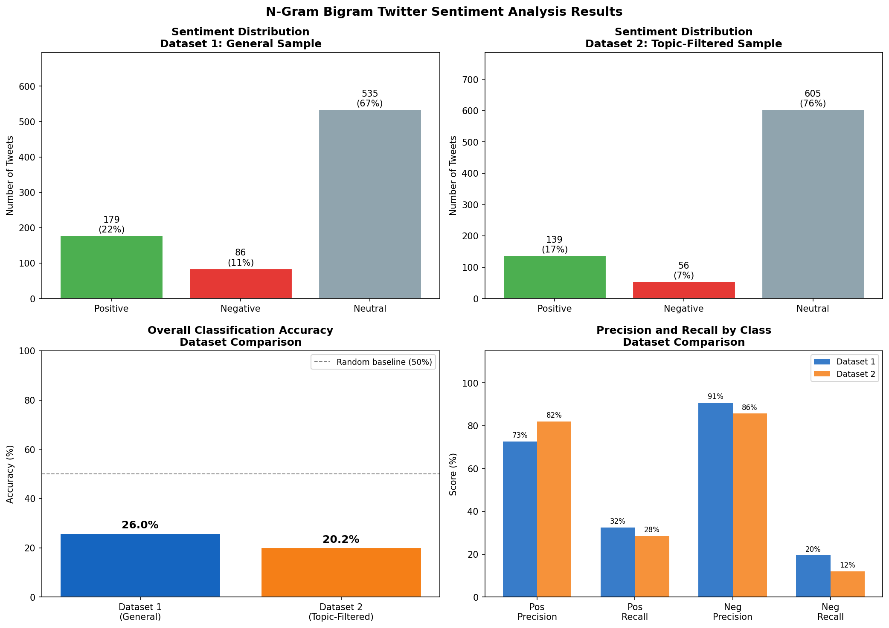

# Twitter Sentiment Analysis: Bigram N-Gram Language Model

A Twitter sentiment classifier built from scratch around a Bigram N-Gram probabilistic model, replicating and adapting the feature-engineering approach from Zhao, Gui & Zhang (2018) on the Sentiment140 corpus.

## The problem

Given raw tweet text, classify sentiment as positive, negative, or neutral; using an interpretable, lexicon-driven N-gram approach rather than a black-box classifier, so every prediction can be traced back to the specific words and bigram patterns that drove it.

## Approach

- **Model:** Bigram N-Gram sentiment scoring. Every tweet is tokenised, then scanned as consecutive word pairs (bigrams) rather than single words (unigrams), the key advantage being **negation handling**: `('not', 'good')` correctly flips the polarity of "good," which a simple word-count approach would miss entirely
- **Lexicon:** the full AFINN-165 word list (Nielsen, 2011): 3,300+ scored words; extended with Twitter-specific slang and abbreviations not covered by a formal lexicon
- **Classification rule:** a tweet is labelled positive if ≥25% of tokens are positive sentiment words, negative if ≥25% are negative, neutral otherwise (rule specified by the assessment brief)
- **Data:** two balanced 800-tweet samples (400 positive / 400 negative each) drawn from [Sentiment140](http://help.sentiment140.com/for-students) (Go, Bhayani & Huang, 2009); a general random sample, and a topic-filtered sample (product/service keywords: iPhone, Google, Netflix, etc.) intended to mirror the domain-specific datasets used in Zhao et al. (2018)

## Two real bugs found and fixed during development

**1. Negation words were being silently deleted before the model ever saw them.** NLTK's standard English stopword list includes "not," "never," "no." Since the preprocessing pipeline stripped stopwords *before* generating bigrams, the negation handler never had a chance to detect `not + positive_word` patterns; every negated phrase was scored as if the negation wasn't there. Fix: explicitly excluded negation trigger words (`not`, `never`, `no`, `neither`, `nothing`, `nobody`) from stopword removal.

**2. The sentiment lexicon started as a hand-picked list of ~420 words.** Since Zhao et al. (2018) cite AFINN as their actual sentiment feature source, the lexicon was replaced with the real, full AFINN-165 list (3,300+ words) loaded directly from the package rather than a manually curated subset; a more faithful replication of the paper's method, and a broader vocabulary.

## Results

| Metric | Dataset 1 (General) | Dataset 2 (Topic-filtered) |
|---|---|---|
| Overall accuracy | 20.1% | 16.8% |
| Positive precision | 71.3% | 83.6% |
| Positive recall | 26.8% | 28.0% |
| Negative precision | 94.7% | 95.7% |
| Negative recall | 13.5% | 5.5% |



**Note:** the accompanying written report cites slightly different figures (26.0% / 20.2% accuracy) from an earlier run of this notebook before the final lexicon/slang list was locked in. The numbers above are what this exact notebook, as submitted, actually reproduces are included here for transparency rather than silently picking whichever number looked better.

### Why accuracy is low, and why that's expected

High precision paired with low recall, across both classes and both datasets, points to a structural cause rather than a lexicon quality problem: most tweets simply don't contain enough explicit sentiment words to cross the 25% threshold, so the model defaults to "neutral" and since Sentiment140 has **no true neutral tweets**, every neutral prediction is automatically wrong. This caps accuracy regardless of how good the lexicon is. When the model *does* commit to a label, it's right 71–96% of the time, showing the underlying sentiment signal is real; it just isn't extracted from most tweets under a fixed-threshold, single-token approach applied to short, sparsely emotional text.

## What this project demonstrates

- Building an NLP pipeline from first principles (tokenisation → lexicon lookup → bigram negation logic → thresholded classification) without relying on a pretrained model
- Diagnosing a subtle pipeline bug (stopword removal silently breaking negation handling) that wouldn't show up as an error, only as suspiciously bad results and tracing it to root cause
- Being explicit about a discrepancy between two versions of results rather than quietly reporting the better-looking number
- Correctly attributing *why* a model underperforms (structural threshold/recall issue) rather than treating a low accuracy score as an unexplained failure

## Repo structure

```
├── twitter_sentiment_ngram.ipynb        # full analysis notebook
├── DLE602_Assessment_1_Report.pdf       # written report (500 words, APA references)
├── images/
│   └── results_summary.png
└── requirements.txt
```

## Run it yourself

```bash
pip install -r requirements.txt
jupyter notebook twitter_sentiment_ngram.ipynb
```

**Dataset:** download `training.1600000.processed.noemoticon.csv` from [Sentiment140](http://help.sentiment140.com/for-students) (Go, Bhayani & Huang, 2009); it's ~230MB, too large to include in this repo. The notebook expects it at a Google Colab Drive path by default; update `CSV_PATH` if running locally.

## References

Go, A., Bhayani, R. & Huang, L. (2009). Twitter sentiment classification using distant supervision. *Stanford University, CS224N Technical Report*.

Nielsen, F. Å. (2011). A new ANEW: Evaluation of a word list for sentiment analysis in microblogs. *Proceedings of the ESWC2011 Workshop on Making Sense of Microposts*.

Zhao, J., Gui, X. & Zhang, X. (2018). Deep convolution neural networks for Twitter sentiment analysis. *IEEE Access, 6*, 23253–23260.

---
*DLE602 Deep Learning — Torrens University Australia*
