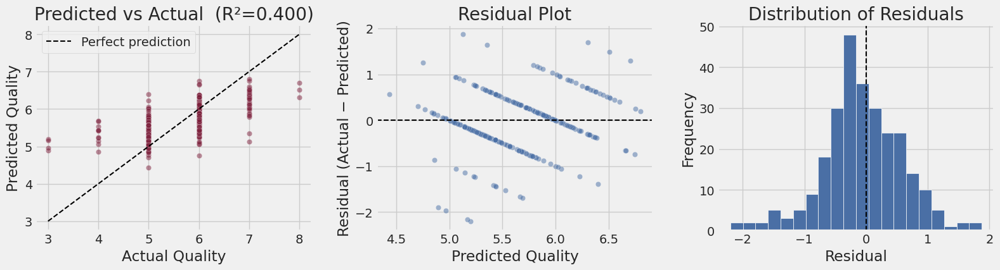

# Red Wine Quality Prediction — Regularised Regression Comparison (CRISP-DM)

Predicting red wine sensory quality (0–10) from 11 physicochemical lab measurements, comparing OLS, Ridge, and Lasso regression under a full CRISP-DM methodology.

## The problem

Wine quality is normally scored by an expert sensory panel — slow, expensive, and subjective. Every batch, however, already has routine lab chemistry data (acidity, sugar, alcohol, sulphates, etc.). This project asks: **can that chemistry data predict the sensory score well enough to be useful for early-stage quality triage** — flagging likely below-average batches before bottling and directing expert tasting time where it matters most — without claiming to replace human judgement outright.

## Dataset

- **Source:** [UCI Machine Learning Repository — Wine Quality (red)](https://archive.ics.uci.edu/ml/datasets/wine+quality)
- 1,599 observations, 11 physicochemical predictors, 1 target (`quality`)
- Scoped to **red wine only** — red and white wines are produced through different processes (skin-contact fermentation vs. not) and pooling them risks confounding the chemistry–quality relationship

## Approach

Followed the full **CRISP-DM** cycle, and deliberately compared three linear regression variants rather than fitting a single model:

1. **Business & data understanding** — success criteria (R², RMSE, residual analysis) defined up front; a moderate R² was treated as an expected outcome, not a failure, since sensory quality has a genuinely subjective component
2. **Data preparation** — removed 240 exact duplicate rows (15% of the dataset) before splitting, to avoid the same observation leaking across train/test; scaler fit only on training data
3. **Modelling** — three techniques compared on 5-fold cross-validated RMSE:
   - **OLS** (`LinearRegression`) — unregularised baseline
   - **Ridge** (L2) — shrinks coefficients, useful given multicollinearity between predictors (e.g. free/total sulfur dioxide, fixed acidity/citric acid/density all correlate)
   - **Lasso** (L1) — can zero coefficients entirely, giving automatic, data-driven feature selection
4. **Evaluate** — held-out 20% test set, checked against residual/normality assumptions, not just the headline number
5. **Deploy (reflection)** — full deployment out of scope per brief; captured as lessons learned instead

## The key finding: default hyperparameters lied

Both Ridge and Lasso were first run at scikit-learn's default `alpha=1.0`. The result:

| Model | Initial CV RMSE |
|---|---|
| OLS | 0.6651 |
| Ridge (α=1.0) | 0.6650 |
| **Lasso (α=1.0)** | **0.8182 — all 11 coefficients zeroed** |

Lasso at the default alpha collapsed to predicting the mean quality score regardless of input — a genuine, informative failure, not a bug. Rather than accepting or arbitrarily changing this, an **alpha sweep with cross-validation** (not train-set RMSE, which would trivially favour the smallest alpha and overfit) was used to find a properly justified value for each model:

| Model | Revised alpha | Revised CV RMSE |
|---|---|---|
| OLS | — | 0.6651 |
| Ridge | 10.0 (10× higher than default) | 0.6648 |
| **Lasso** | **0.01 (100× lower than default)** | **0.6643 — winner** |

At its tuned alpha, Lasso automatically zeroed 4 of 11 features (`fixed acidity`, `citric acid`, `residual sugar`, `density`) while keeping `alcohol`, `volatile acidity`, and `sulphates` as its strongest predictors — independently confirming the same variables the correlation analysis had flagged, but via a principled, data-driven mechanism rather than manual judgement.

## Final results (held-out test set)

| Metric | Value |
|---|---|
| R² | **0.400** |
| RMSE | 0.652 quality points |
| MAE | 0.501 quality points |



- **Alcohol** is the strongest predictor (correlation +0.476), followed by **volatile acidity** (−0.391) and **sulphates** (+0.251)
- **Citric acid** flips sign between simple correlation (+0.226) and its multivariate coefficient — a visible consequence of multicollinearity, and the reason correlation alone isn't a safe basis for feature selection
- The model explains ~40% of variance and predicts within about half a quality point — genuinely useful for triage, but not a replacement for expert tasting, particularly at the quality extremes (only 10 wines scored 3, only 18 scored 8 in the whole dataset)

## What this project demonstrates

- Comparing multiple modelling techniques instead of committing to one, which surfaced a hyperparameter failure that a single-model approach would have missed entirely
- Correct use of cross-validation for hyperparameter selection (vs. the methodologically flawed shortcut of picking alpha by training-set error)
- Diagnosing and explaining a multicollinearity-driven coefficient sign reversal
- Avoiding data leakage (scaler fit only on training data, duplicates removed pre-split)
- Being upfront about model limitations instead of cherry-picking favourable numbers

## Repo structure

```
├── wine_quality_regression.ipynb   # full analysis, CRISP-DM structured
├── images/                         # key plots referenced above
├── requirements.txt
└── README.md
```

## Run it yourself

```bash
pip install -r requirements.txt
jupyter notebook wine_quality_regression.ipynb
```

The notebook loads the dataset directly from the UCI repository URL, no manual download needed.

## Reference

Cortez, P., Cerdeira, A., Almeida, F., Matos, T. & Reis, J. (2009). Modeling wine preferences by data mining from physicochemical properties. *Decision Support Systems*, 47(4), 547–553.

---
*MLN601 Machine Learning — Torrens University Australia*
